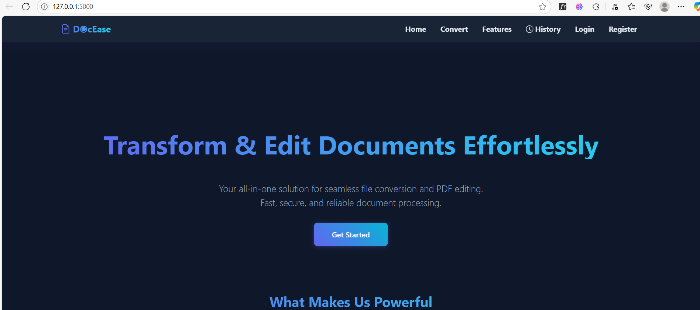
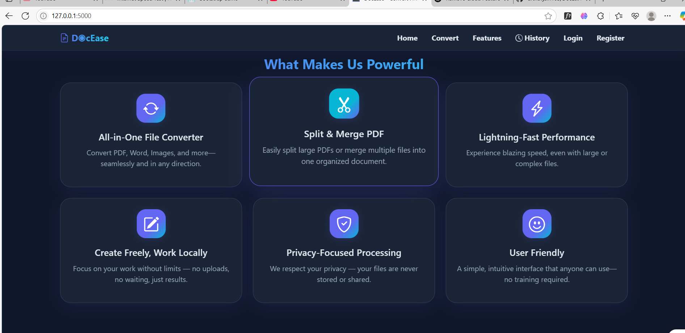
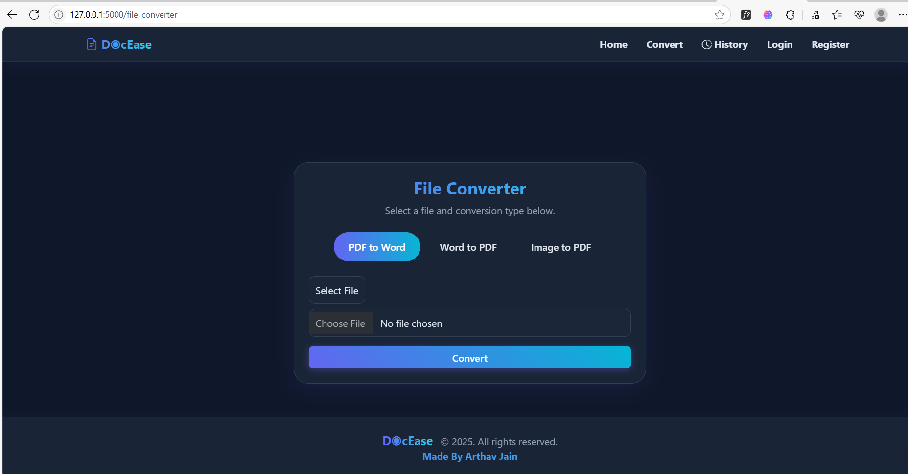

# DocEase: Convert & Edit Your Documents Seamlessly

 **DocEase** is your go-to solution for seamless document handling — convert PDFs, Word docs, and images effortlessly, and edit PDFs with advanced split, merge, and security features. All wrapped in a beautiful, responsive interface built using Tailwind CSS, Bootstrap, and GSAP animations.

**Now with enhanced security, proper logging, and Python 3.10+ support!** 🔒

---

## 🌟 Features

### 🔄 All-in-One File Converter

- Convert PDF ↔ Word (DOCX) seamlessly
- Transform images (JPG, PNG) into PDF documents
- Fast and reliable conversion with proper error handling

### 📑 Powerful PDF Editor

- **Split PDF:** Extract specific pages or split entire PDFs into individual files
  - Outputs can be downloaded as separate PDFs or bundled in a ZIP file
- **Merge PDF:** Combine multiple PDF documents into a single, organized file
- **Encrypt PDF:** Secure your PDF files with password protection
- **Decrypt PDF:** Remove passwords from encrypted PDF files

### 📋 Conversion History

- Every conversion or PDF operation is logged automatically
- Dedicated History page to review past actions
- Re-download files whenever needed
- User-specific conversion tracking

###  Modern UI/UX

- Clean, responsive interface with glassmorphism design
- Built with Bootstrap 5, Tailwind CSS, and GSAP animations
- Works smoothly on desktop and mobile devices
- Intuitive layouts with smooth transitions

### Privacy-Focused & Secure

- **Local Processing:** All file processing happens on your system
- **No Cloud Upload:** Your documents never leave your computer
- **CSRF Protection:** All forms protected with security tokens
- **Secure Sessions:** HTTPONLY and SameSite cookie protection
- **Path Validation:** Protection against directory traversal attacks

### ⚡ Fast & Reliable

- Optimized for quick processing
- Automatic temporary file cleanup
- Lightweight, stable dependencies
- Comprehensive error logging

---

## Security 

✅ **CSRF Protection** - All sensitive operations protected with tokens  
✅ **Environment-Based Config** - Secrets in .env, not in code  
✅ **Structured Logging** - Full audit trail of operations  
✅ **Session Security** - HTTPONLY and SameSite cookies  
✅ **File Validation** - Path traversal and extension validation  
✅ **Automatic Cleanup** - Temporary files cleaned up on shutdown  
✅ **Python 3.10+ Support** - Full compatibility with modern Python

---

## 🖼️ Demo Screenshots





---

## 🧭 User Flow

1. **Landing Page** - Welcome screen with Get Started button
2. **Choose Action** - Select: Convert Files or Edit PDFs
3. **Upload Files** - Select and upload your documents
4. **Process** - Download your converted, encrypted, or edited file
5. **History** - View/download your personal conversion history

---

## Getting Started

### Prerequisites

- Python 3.8+ (Python 3.10+ recommended for full compatibility)
- pip package manager
- Virtual environment (recommended)

### Installation

#### 1. Clone the Repository

```bash
git clone https://github.com/arthavjain103/DocEase.git
cd DocEase
```

#### 2. Create Virtual Environment

**Windows:**

```powershell
python -m venv venv
venv\Scripts\activate
```

#### 3. Install Dependencies

```bash
pip install -r requirements.txt
```

#### 4. Configure Environment Variables

The `.env` file is already created with default values. For production, update it:

```bash
# Edit .env file
FLASK_ENV=development
SECRET_KEY=your-secret-key-change-in-production
UPLOAD_FOLDER=uploads
MAX_UPLOAD_SIZE=40
```

To generate a secure SECRET_KEY:

```bash
python -c "import os; print(os.urandom(24).hex())"
```

#### 5. Run the Application

```bash
python app.py
```

#### 6. Access the Application

Open your browser and visit: [http://127.0.0.1:5000](http://127.0.0.1:5000)

---

## � Project Structure

```
DocEase/
├── app.py                          # Main Flask application
├── config.py                       # Configuration management
├── security.py                     # Security utilities
├── forms.py                        # CSRF-protected forms
├── compatibility.py                # Python 3.10+ compatibility
├── requirements.txt                # Python dependencies
├── .env                           # Environment variables (keep secret!)
├── conversions.db                 # SQLite database (auto-created)
├── uploads/                       # Temporary file storage
├── templates/
│   ├── base.html                 # Base template
│   ├── home.html                 # Homepage
│   ├── login.html                # Login page
│   ├── register.html             # Registration page
│   ├── converter.html            # File converter
│   ├── pdf_editor.html           # PDF editor
│   ├── encrypt.html              # PDF encryption
│   ├── decrypt.html              # PDF decryption
│   └── logs.html                 # Conversion history
├── static/
│   ├── style.css                 # Custom styles
│   └── js/
│       └── main.js               # JavaScript functionality
└── screenshots/                  # Demo screenshots
```

---

## 🛠️ Tech Stack

### Backend

- **Flask** (2.3.3) - Web framework
- **Flask-WTF** (1.1.1) - Secure forms with CSRF protection
- **Flask-Login** (0.6.3) - User session management
- **Flask-SQLAlchemy** (3.1.1) - Database ORM

### File Processing

- **PyPDF2** (3.0.1) - PDF operations (merge, split, encrypt, decrypt)
- **pdf2docx** (0.5.8) - PDF to Word conversion
- **docx2pdf** (0.5.1) - Word to PDF conversion
- **Pillow** (10.1.0) - Image processing

### Frontend

- **Bootstrap 5** - Responsive UI framework
- **Tailwind CSS** - Utility-first CSS
- **GSAP** - Smooth animations
- **Bootstrap Icons** - Icon library

### Database

- **SQLite3** - Local database for logs

### Security

- **Werkzeug** (2.3.7) - Password hashing and security
- **python-dotenv** (1.0.0) - Environment variable management

---

## 🔒 Security Features

### CSRF Protection

All forms are protected with CSRF tokens via Flask-WTF:

- `/register` - Registration form
- `/login` - Login form
- `/encrypt` - PDF encryption
- `/decrypt` - PDF decryption
- `/file-converter` - File conversion
- `/pdf-editor` - PDF operations

### Session Security

- HTTPOnly cookies - Prevents JavaScript access to session
- SameSite=Lax - Prevents CSRF attacks
- Secure flag - Set to True in production with HTTPS

### File Validation

- Extension whitelist validation
- Path traversal attack prevention
- File size enforcement
- Magic byte verification for PDFs

### Configuration Management

- Sensitive data stored in `.env` (not committed to git)
- Environment-specific configurations
- Secure defaults for production

---

## 📊 Logging & Monitoring

The application includes comprehensive logging:

```
2025-11-14 10:30:45,123 - app - INFO - Starting conversion: pdf-to-word
2025-11-14 10:30:46,456 - app - DEBUG - PDF loaded successfully
2025-11-14 10:30:47,789 - app - INFO - Conversion successful: output.docx
```


##  Automatic Cleanup

The application automatically cleans up temporary files:

- Temporary files cleaned on application shutdown
- Prevents disk space accumulation
- All cleanup operations logged

---


## License

This project is licensed under the MIT License. See the [LICENSE](LICENSE) file for details.


## Credits

- **GSAP** - Smooth animations library
- **Bootstrap** - Responsive UI framework
- **Tailwind CSS** - Utility-first CSS framework
- **Bootstrap Icons** - Icon library
- **PyPDF2** - PDF manipulation library
- **pdf2docx** - PDF to Word conversion

