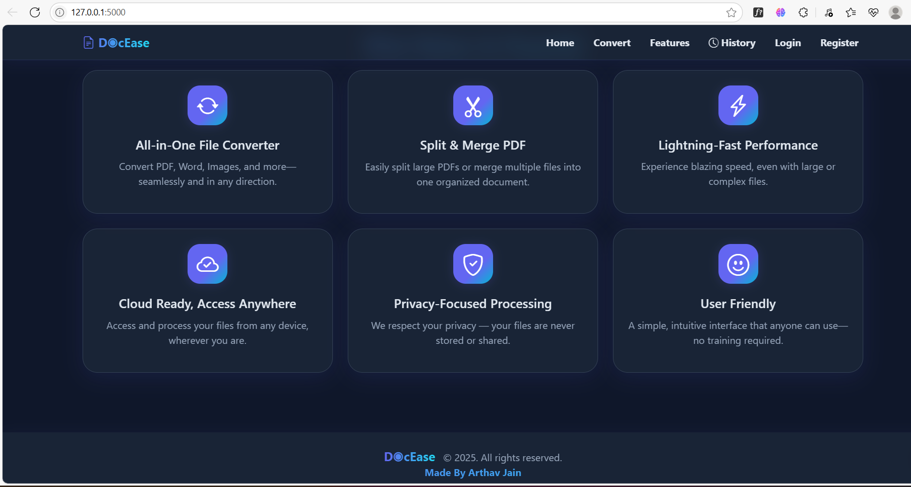

# DocEase: Convert & Edit Your Documents Seamlessly

✨ A modern web app for converting files between PDF, Word, and image formats — and editing PDFs with powerful split & merge tools. Features a clean, responsive design using Bootstrap and Tailwind CSS.

---

## 🚀 Features

- **All-in-One File Converter:**
  - Convert files between PDF and Word formats seamlessly.
  - Quickly transform images (JPG, PNG) into PDF documents.
- **Powerful PDF Editor:**
  - **Split PDF:** Extract specific pages or split entire PDFs into individual files. Outputs can be downloaded as separate PDFs or bundled in a ZIP file.
  - **Merge PDF:** Combine multiple PDF documents into a single, organized file in seconds.
- **Conversion History:**
  - Every conversion or PDF operation is logged automatically. The app provides a dedicated History page where you can review past actions and re-download files if needed.
- **Modern UI:**
  - Clean, responsive, and easy-to-navigate interface built with Bootstrap, Tailwind CSS, and custom styles. Works smoothly across desktop and mobile devices, with intuitive layouts and subtle animations.
- **Privacy-Focused:**
  - All file processing happens locally on your system. No files are uploaded to external servers — ensuring your documents remain private and secure.
- **Fast & Reliable:**
  - Optimized for quick processing so you can convert or edit files without delays. Lightweight dependencies ensure stability and performance even on lower-end machines.

---

## 🖼️ Demo





---

## 🧭 User Flow

1. **Landing Page:** Welcome screen with Get Started button
2. **Choose Action:** Convert files or edit PDFs
3. **Upload Files:** Select and upload your files
4. **Process:** Download your converted or edited document
5. **History:** View/download past conversions

---

## ⚙️ Getting Started

1. **Clone the repository:**
   ```bash
   git clone https://github.com/yourusername/DocEase.git
   cd DocEase
   ```
2. **Create and activate a virtual environment (recommended):**
   ```bash
   python -m venv venv
   # Windows:
   venv\Scripts\activate
   # macOS/Linux:
   source venv/bin/activate
   ```
3. **Install dependencies:**
   ```bash
   pip install -r requirements.txt
   ```
4. **Run the app:**
   ```bash
   python app.py
   ```
5. **Visit:** [http://127.0.0.1:5000](http://127.0.0.1:5000)

---

## 📂 File Storage

- Files are saved temporarily in `uploads/`
- Conversion logs are stored in `conversions.db` (SQLite)

---

## 🏗️ Tech Stack

- **Flask:** Web framework for backend and routing
- **WTForms / Flask-WTF:** Secure forms and file uploads
- **PyPDF2:** PDF split/merge operations
- **pdf2docx / docx2pdf:** PDF ↔ Word conversion
- **Pillow:** Image to PDF conversion
- **Bootstrap 5 + Tailwind CSS:** Responsive, modern UI
- **GSAP:** Smooth homepage and UI animations
- **SQLite3:** Local database for conversion logs

---

## 🎨 Customization

- **Styles:** Edit `static/style.css` for custom styles
- **Templates:** Modify HTML files in `templates/` for UI changes

---

## 🙏 Credits

- Animations by GSAP library
- Icons from Bootstrap Icons and Font Awesome
- UI inspired by modern glassmorphism and Tailwind/Bootstrap themes

---

## 📄 License

This project is licensed under the MIT License. See the [LICENSE](LICENSE) file for details.
